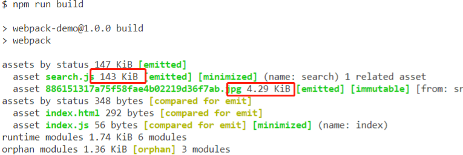
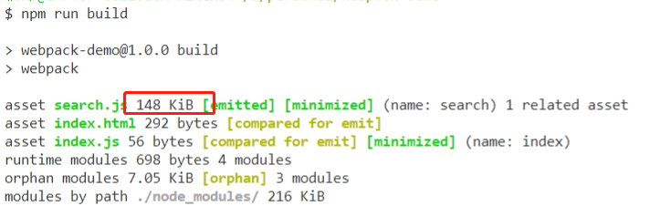
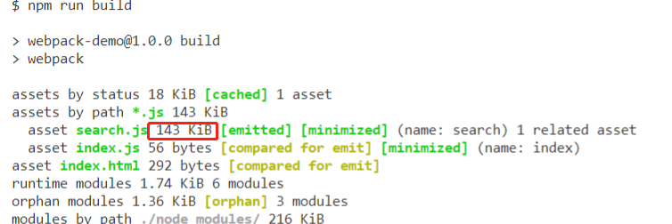

# Loaders
- webpack开箱即用只支持js和json两种文件类型，通过loaders去支持其他文件类型并且把他们转换成有效的模块，并且可以添加到依赖图中
- 本身是一共函数，接受源文件作为参数，返回转换后的结果

## 常见的Loaders

| 名称          | 描述                                                  |
| ------------- | ----------------------------------------------------- |
| bable-loader  | 转换es6,es7等js新特性语法                             |
| css-loader    | 支持.css文件的加载和解析                              |
| less-loader   | 将less文件转成css                                     |
| ts-loader     | 将ts转换成js                                          |
| file-loader   | 进行图片，字体等的打包;                               |
| url-loader    | url-loader自动做base64的转换，功能和file-loader差不多 |
| raw-loader    | 将文字以字符串的形式导入                              |
| thread-loader | 多进程打包js和css                                     |

### babel-loader

- webpack.config.js需要做如下配置

```js
module.exports = {
    ...
    rules: [
        // ...
        {
            test: /\.js$/, // 注意，没有引号
            use: 'babel-loader'
        }
        // ...
    ]
}
```

- 新建`.babelrc`

  ```js
  //.babelrc
  {
      "presets": [
          "@babel/preset-env",
          "@babel/preset-react" // 解析react相关语法
      ],
      "plugins": [
          "@babel/proposal-class-properties"
      ]
  }
  ```


- 安装相关插件：

  - `npm i @babel/core @babel/preset-env babel-loader -D`

  

## 使用loaders

```js
module.exports = {
    module: {
        rules: [
            {
                test: /\.txt$/, // 匹配规则
                use: 'raw-loader'
            }
        ]
    }
}
```

### Loader处理css，less等(style-loader, css-loader, less-loader, less)

- 安装相关样式loader: `npm i style-loader css-loader less-loader less -D // 注意，less也要install`

```js
module.exports = {
    module: {
        rules: [
            {
                test: /\.css$/,
                use: [
                    'style-loader',
                    'css-loader'
                ]
            },
            {
                test: /\.less$/,
                use: [
                    'style-loader',
                    'css-loader',
                    'less-loader'
                ]
            }
        ]
    }
}
```

### Loader解析图片(file-loader | url-loader)

- 安装file-loader | url-loader

- 使用file-loader实现解析

  - 由图可知，图片和search分开打包，search.js是143k, 图片是18k

  ```js
  module.exports = {
      module: {
          rules: [
              {
                  test: /\.(png|jpg|jpeg|gif)$/,
                  use: 'file-loader'
              }
          ]
      }
  }
  ```



- 使用url-loader解析

  - 此处options限制了大小是10k, 如果解析的图片资源在10k以内，就会被打包进入对应js文件，也可正确解析（通过对比file-loader打包结果可得）

    

  - 若是打包的图片超过10k会如何呢？由图可知，不会被打包到js里

  

  ```js
  module.exports = {
      module: {
          rules: [
              {
                  test: /\.(png|jpg|jpeg|gif)$/,
                  use: [
                      {
                           loader: 'url-loader',
                           options: {
                             limit: 10240
                           }
                       }
                  ]
              }
          ]
      }
  }
  ```

  
