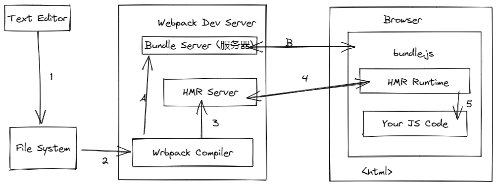

# webpack中的文件监听

- 源码发生变化时，自动构建出新的输出文件。

- 缺陷：浏览器需要手动刷新。

- 输出放到本地磁盘里

- 开启监听的方式：

  - 启动webpack命令时，带上`--watch`参数

    - package.json里

      ```js
      "scripts": {
          "watch": "webpack --watch"
      }
      ```

    - 

  - 在webpack.config.js中设置watch： true

## 文件监听的原理分析

**轮询判断文件的最后编辑时间是否变化**

某个文件发生变化，并不会立刻告诉监听者，而是先缓存起来，等aggregateTimeout

```js
module.export = {
    watch: true, // 默认false,也就是不开启
    watchOptions: { // 只有开启监听模式时，watchOptions才有意义
        ignored: /node_modules/, // 默认为空，不监听的文件或者文件夹，支持正则匹配
        aggregateTimeout: 300, // 监听到变化发生后会等300ms再去执行，默认300ms
        poll: 1000 // 判断文件是否发生变化是通过不停询问系统指定文件有没有变化实现的，默认每秒询问1000次
    }
}
```

## 进阶一：webpack热更新——webpack-dev-server

- 构建更有优势
  - 不刷新浏览器
  - 不输出文件，而是放在内存中
  - 使用HotModuleReplacementPlugin插件

- 使用

  ```js
  'use strict';
  
  const path = require('path');
  const webpack = require('webpack'); // 引入webpack
  module.exports = {
      entry: {
          // 略
      },
      output: {
           // 略
      },
      mode: 'development', // 'development' | 'production', wds需要在开发环境而非生产环境下
      module: {
          rules: [
              // 略
          ]
      },
      plugins: [
          new webpack.HotModuleReplacementPlugin(), // webpack自带
      ],
      devServer: {
          // 4是contentBase: './dist'
          // 5是static...
          static: { 
              directory: path.join(__dirname, './dist'),
          },
          hot: true
      }
  }
  ```

  ### 进阶二：webpack热更新——webpack-dev-middle

- 优势

  - wdm将webpack输出的文件传输给服务器
  - 适用于灵活的定制场景

### 热更新的原理分析

- webpack compile：将js编译成bundle

- hmr server: 将热更新的文件输出给hmr runtime

- bundle server: 提供文件在浏览器的访问

- hmr runtime: 会被注入到浏览器，更新文件的变化

- bundle.js 构建输出的文件

  